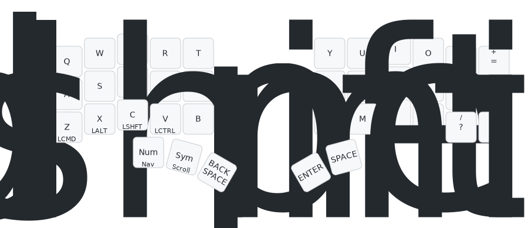
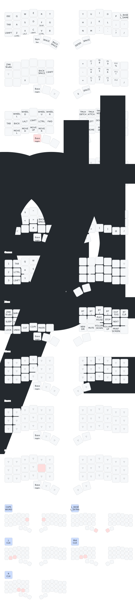

[](https://github.com/280Zo/charybdis-wireless-mini-zmk-firmware/actions/workflows/build.yml)

## Intro

This repository offers pre-configured ZMK firmware designed for [Wireless Charybdis keyboards](https://github.com/280Zo/charybdis-wireless-mini-3x6-build-guide?tab=readme-ov-file). It supports both Bluetooth/USB and Dongle configurations and uses the latest input listener and processors to act as a bridge between the trackball and the rest of the system.

If you want to customize things the repo is set up to build through GitHub Actions (just clone and run it), or you can use the
containerized build script that will build all firmwares locally with a single command.


## Quick Start

### Flashing the Firmware

Download your choice of firmware from the Releases page. Choose a combination of format (Bluetooth/Dongle) and layout (QWERTY, etc.), then follow the steps below to flash it to your keyboard

1. Unzip the firmware zip
2. Plug the right half into the computer through USB
3. Double press the reset button
4. The keyboard will mount as a removable storage device
5. Copy the applicable uf2 file into the NICENANO storage device (e.g. charybdis_qwerty_dongle.uf2 -> dongle)
6. It will take a few seconds, then it will unmount and restart itself.
7. Repeat these steps for all devices.
8. You should now be able to use your keyboard

> [!NOTE]  
> If you are flashing the firmware for the first time, or if you're switching between the dongle and the Bluetooth/USB configuration, flash the reset firmware to all the devices first. Do not follow the instructions you might find in other repositories to delete all of the files from the device and eject and then re-load as this can brick your Nice!Nano or the SeedStudio in the prospector (ask me how I know...).

### Overview & Usage



To see all the layers check out the [full render](keymap-drawer/qwerty.svg).

⌨️ Keyboard Layers
| # | Layer      | Purpose                                                          |
| - | ---------- | ---------------------------------------------------------------- |
| 0 | **BASE**   | Standard typing with timeless home-row mods                      |
| 1 | **NUM**    | Combined digits + F-keys (tap for numbers, hold for functions)   |
| 2 | **NAV**    | Arrow keys, paging, TMUX navigation, mouse pointer               |
| 3 | **MOUSE**  | Full auto-mouse-key layer (pointer + wheel)                      |
| 4 | **SYM**    | Symbols, punctuation, and a couple of helpers                    |
| 5 | **GAME**   | Gaming layer (just key-codes, no mods)                           |
| 6 | **EXTRAS** | Shortcuts, functions & snippets                                  |
| 7 | **SLOW**   | Low-speed pointer for pixel-perfect work                         |
| 8 | **SCROLL** | Vertical/Horizontal scroll layer                                 |

These are the layers as of 10/31/2025. I do not intend to use this keyboard for gaming, etc. So, I foresee a future where there are far fewer layers with an effort to try to match up to the [Miryoku](https://github.com/manna-harbour/miryoku) schema for layers.

⌨️ Keyboard Layer Activation Keys
| # | Layer      | Purpose                                                 |
| - | ---------- | ------------------------------------------------------- |
| 0 | **BASE**   | Standard typing layer. Currently QWERTY.                |
| 1 | **NUM**    | On press of `K36`                                       |
| 2 | **NAV**    | On hold of `K36`                                        |
| 3 | **MOUSE**  | Automatically activated by trackball movement           |
| 4 | **SYM**    |                                                         |
| 5 | **GAME**   |                                                         |
| 6 | **EXTRAS** | `K38 + K39` (inner most thumb key on each half)         |
| 7 | **SLOW**   |                                                         |
| 8 | **SCROLL** | Activated by holding down the K16 currently             |

🏠 Home-Row Mods (That Aren't Really)

I don't like home row mods because I just haven't ever really committed to using them. Instead, I use mods on the left side only and on the bottom row (z, x, c). In addition, I put shift in it's normal position on the outside of both sides.

| Side                | Hold = Modifier              | Tap = Letter / Key  |
| ------------------- | ---------------------------- | ------------------- |
| Left                | **Command / Option / Control ** | `Z X C`          |


🔗 Combos
| Trigger Keys               | Result                                 |
| -------------------------  | -------------------------------------- |
| `K17 + K18`                | **Caps Word** (one-shot words in CAPS) |
| `J`                        | **Left Click**                         |
| `K`                        | **Middle Click**                       |
| `L`                        | **Right Click**                        |
| `K36`                      | Go back to **BASE** layer from any current layer                 |
| `K38 + K39` (thumb cluster)| Layer-swap **BASE ⇄ EXTRAS**           |  

🔗 Combos I want to add to match what I have used previously
| Trigger Keys                  | Result                                 |
| -------------------------     | -------------------------------------- |
| Double Tap `C`                | **Copy** Double tapping C should generate a CMD*C keystroke |
| Double Tap `X`                | **Cut** Double tapping X should generate a CMD*X keystroke |
| Double Tap `V`                | **Paste** Double tapping V should generate a CMD*V keystroke |
| Double Tap `Z`                | **Undo** Double tapping Z should generate a CMD*Z keystroke |
| Triple Tap `Z`                | **Redo** Triple tapping Z should generate a SHIFT*CMD*Z keystroke |
| Double Tap `S`                | **Save** Double tapping S should generate a CMD*S keystroke |
| Double Tap `B`                | **Bold** Double tapping B should generate a CMD*B keystroke |
| Double Tap `I`                | **Italics** Double tapping I should generate a CMD*I keystroke |
| Double Tap `O`                | **Underline** Double tapping U should generate a CMD*U keystroke |
| Double Tap `Left Shift`       | **Caps Lock** Double tapping the left Shift should generate activate or deactivate the capslock |
| Double Tap `.`                | **Exclamation Point** Double tapping . should generate a ! keystroke |
| Double Tap `-`                | **Emdash** Double tapping - should generate an emdash |
| `K5 + K6`                     | Shift+Cmd+4 to generate a selective screen shot          |  

⌨️ Base layer changes I still need to make
| Trigger Keys                  | Result                                 |
| -------------------------     | -------------------------------------- |
| `K11`                         | = and + (on shift) |
| `K32`                         | , and < (on shift) |
| `K33`                         | . and > (on shift) |
| `K34`                         | ? and / (on shift instead of exclamation point on shift) |
| `K35`                         | - and _ (on shift) |
| `K37`                         | **Layer Shift** to Sym on tap and to Scroll on hold. Maybe Slow on double tap? |
| `K16`                         | Make it so that it is only the F key. No longer tied to a scroll layer shift |

⌨️ Nav layer changes I still need to make
| Trigger Keys                  | Result                                 |
| -------------------------     | -------------------------------------- |
| `K39`                         | **On Tap** Volume down **On Double Tap** Mute/Unmute |
| `K40`                         | Volume up |
| `K7`                          | Shift desktop left |
| `K9`                          | Shift desktop right |
| `K8`                          | Up arrow |
| `K20`                         | Down arrow |
| `K19`                         | Left arrow |
| `K21`                         | Right arrow |

⌨️ Num layer changes I still need to make
| Trigger Keys                  | Result                                 |
| -------------------------     | -------------------------------------- |
| `K6`                          | 0 |
| `K7`                          | 1 |
| `K8`                          | 2 |
| `K9`                          | 3 |
| `K19`                         | 4 |
| `K20`                         | 5 |
| `K21`                         | 6 |
| `K31`                         | 8 |
| `K32`                         | 8 |
| `K33`                         | 9 |
| `K18`                         | , |
| `K11`                         | + |
| `K12`                         | - |
| `K3`                          | Up Arrow |
| `K15`                         | Down Arrow |
| `K16`                         | Right Arrow |
| `K14`                         | Left Arrow |
| `K17`                         | Nothing. This is currently set to a shift. We don't need that since the transparency will allow us to still access a shift key |

⌨️ Symbol layer changes I still need to make
| Trigger Keys                  | Result                                 |
| -------------------------     | -------------------------------------- |
| `K18`                         | $ |
| `K30`                         | # |

I might be able to do away with the Extras layer with a few more additions to the Num, Nav, and Sym layers. I will do away with the Game layer regardless as it is not useful for me.



⚙️ Other things I want to implement over time.
- **TARMAK transition to Colemak:** One of the reasons for moving to the Keyball and then the Charybdis was to begin transitioning from QWERTY to Colemak. However, given the large transition from the Ergodox to the Keyball61 and now to the Charybdis Mini, I want to stage my transition to a new keymap. [Tarmak](https://dreymar.colemak.org/tarmak-intro.html) was built as a step-wise transition from QWERTY to Colemak (specifically I believe I will end up using the DH variant of Colemak).
- **Timeless home row mods:** Based on [urob's](https://github.com/urob/zmk-config#timeless-homerow-mods) work and configured on the BASE layer with balanced flavor on both halves (280 ms tapping-term, and quick-tap with prior-idle tuning). As I said above, I do not currently use homerow mods, but I do see their value and would like to try to implement them over time.
- **Thumb-scroll mode:** Hold a thumb button (K36 through 40) while moving the trackball to turn motion into scroll. Currently I have this mapped to the F key (K16). 
- **Precision cursor mode:** Double-tap, then hold the same thumb button as the scroll mode to drop the pointer speed, release to return to normal speed. Currently this produces an unintended affect where holding down the F key does generate the scrolling behavior but when you release the F key, the precision pointer speed remains until I hit K36 to return to the base layer. I want to re-work what keys are used for this if I am going to have something like this. Frankly, it might not be necessary.
- **Mouse-Click on a thumb button**
  - Tap: Left mouse click
  - Tap & Hold: holds the left mouse button
  - Double-Tap & Hold: Layer 3 (symbols) while the key is held
  - Double-Tap: Double mouse click
  - I currenty use JKL for my left, middle, and mouse click. However, I do think the thumb keys might be a good option for clicking behaviors. Would be worth eventually exploring. There are ways in ZMK to make this type of complex behavior consistent and predictable and that might be helpful.
- **Backspace + Number-Layer - K38**
  - Tap: Backspace
  - Hold: Layer 1 (numbers) while the key is held
  - Double-Tap & Hold: Keeps Backspace held
  - I currently have the movement to the number layer on a different with a different behavior. However, I like this idea and will try to implement it when I get more comfortable with the number layer itself.
- **PMW3610 low power trackball sensor driver:** Provided by [badjeff](https://github.com/badjeff/zmk-pmw3610-driver)
  - Patched to remove build warnings and prevent cursor jump on wake
  - I want to try to adjust the angle the sensor is reading. What I think of as "up" currently is 45 degrees counter clockwise from up.
  - Also need to work on fixing accidental triggers of the auto-mouse layer.
- **Hold-tap side-aware triggers:** Each HRM key only becomes a modifier if the opposite half is active, preventing accidental holds while one-handed.
- **Quick-tap / prior-idle:** Tuned for faster mod-vs-tap detection.
- **ZMK Studio:** Supported on BT builds for quick and easy keymap adjustments. Dongle support will come soon. The -bt build does currently function with Studio, but I want to make it a little easier.


## Customize Keymaps, Layers, & Trackball

This section will help you personalize your firmware. Everything—from keys and layers to advanced trackball behaviors—can easily be customized, even if you're new to ZMK.

### Building Only Specific Keymaps or Shields

By default both Bluetooth and Dongle formats will build firmware pairs for the QWERTY, Coleman DH, and Graphite keymaps. To save time and streamline your builds, you can build just a single keymap or shield that you're interested in:

**Single keymap:**
Any `.keymap` files in the `config/keymap/` directory will be automatically built. By default QWERTY and Colemak DH are included, but you can add or remove as many as you'd like as long as there is at least one .keymap file to process.
Some additional keymaps are available in the extra-keymaps directory.

**Single shield format (Dongle or Bluetooth):**
Delete the shield directory (charybdis_dongle or charybdis_bt) from the config/boards/shields/ folder to build only the format you need.


### Modify Key Mappings

**ZMK Studio**

[ZMK Studio](https://zmk.studio/) allows users to update functionality during runtime. It's currently only implemented on the Bluetooth builds.

To change the visual layout of the keys, the physical layout must be updated. This is the charybdis-layouts.dtsi file, which handles the actual physical positions of the keys. Though they may appear to be similar, this is different than the matrix transform file (charybdis.json) which handles the electrical matrix to keymap relationship.

To easily modify the physical layout, or convert a matrix transform file, [caksoylar](https://github.com/caksoylar/zmk-physical-layout-converter) has built the [ZMK physical layouts converter](https://zmk-physical-layout-converter.streamlit.app/).

For more details on how to use ZMK Studio, refer to the [ZMK documentation](https://zmk.dev/docs/features/studio).

**Keymap GUI**

Using a GUI to generate the keymap file before building the firmware is another easy way to modify the key mappings. Head over to nickcoutsos' keymap editor and follow the steps below.

- Fork/Clone this repo
- Open a new tab to the [keymap editor](https://nickcoutsos.github.io/keymap-editor/)
- Give it permission to see your repo
- Select the branch you'd like to modify
- Update the keys to match what you'd like to use on your keyboard
- Save
- Wait for the pipeline to run
- Download and flash the new firmware

**Edit Keymap Directly**

To change a key layout choose a behavior you'd like to assign to a key, then choose a parameter code. This process is more clearly outlined on ZMK's [Keymaps & Behaviors](https://zmk.dev/docs/features/keymaps) page. All keycodes are documented [here](https://zmk.dev/docs/codes) page

Open the config/keymap/charybdis.keymap file and change keys, or add/remove layers, then merge the changes and re-flash the keyboard with the updated firmware.


### Modifying Trackball Behavior

The trackball uses ZMK's modular input processor system, making it easy to adjust pointer behavior to your liking. All trackball-related configurations and input processors are conveniently grouped in the `config/charybdis_pointer.dtsi` file. Modify this file to customize tracking speed, acceleration, scrolling behavior, and more—then rebuild your firmware.


### Building Your Customized Firmware

You can easily build your firmware locally or leverage GitHub Actions:

**Local Build (recommended for quick testing and debugging)**

Clone this repo, then run these commands from the repo root:
```sh
cd local-build
docker-compose run --rm builder
```
See the [local build README](local-build/README.md) for additional details, including how to enable USB logging in the builds.

**GitHub Actions**

- Fork or clone this repo
- Push your changes to your GitHub
- GitHub Actions automatically builds your firmware and publishes downloadable artifacts under the Actions tab.


### Troubleshooting

- If the keyboard halves aren't connecting as expected, try pressing the reset button on both halves at the same time. If that doesn't work, follow the [ZMK Connection Issues](https://zmk.dev/docs/troubleshooting/connection-issues#acquiring-a-reset-uf2) documentation for more troubleshooting steps.
- If you run into a bug or something’s not working, feel free to open an issue or submit a PR! Just keep in mind I'm not a developer, and this is a hobby project so I may not be able to fix everything.


## Credits

- [badjeff](https://github.com/badjeff)
- [eigatech](https://github.com/eigatech)
- [nickcoutsos](https://github.com/nickcoutsos/keymap-editor)
- [caksoylar](https://github.com/caksoylar/keymap-drawer)
- [urob](https://github.com/urob/zmk-config#timeless-homerow-mods)